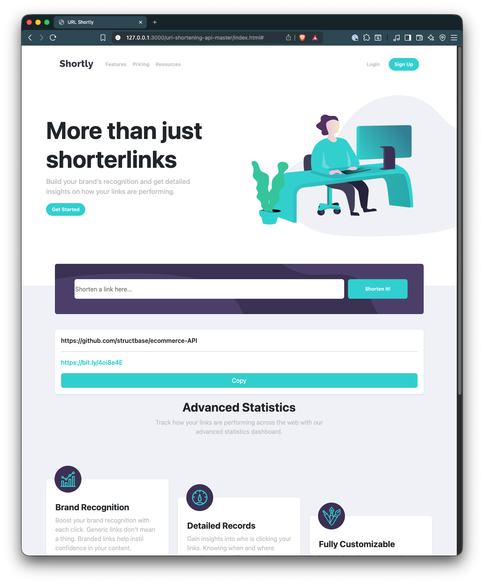
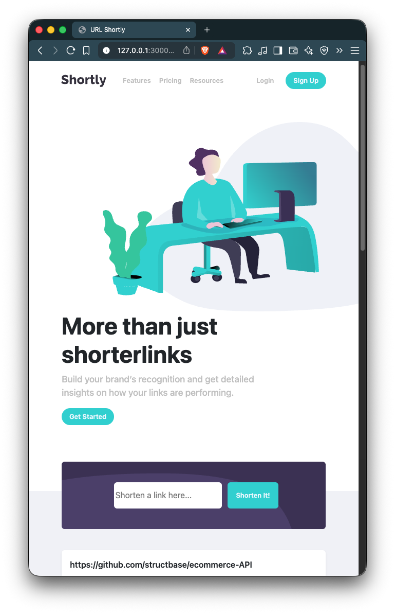

# 🚀 Shortly – URL Shortening App

A clean and responsive URL shortening web application inspired by the **Frontend Mentor Shortly challenge**.
This version integrates with the **Bitly API**, stores links using **Local Storage**, and includes a fully styled link history UI with copy buttons.

---

### 🎯 Objectives / The Challenge

The goal of this project is to build a fully functional URL-shortening landing page that integrates with the **Bitly API** to generate shortened URLs. The design and layout aim to closely match the original challenge specifications while ensuring a smooth and responsive user experience across all devices.

This project serves as practice for working with external APIs, managing client-side data, handling errors, and building clean, interactive UI components. Any tools or libraries can be used, allowing flexibility and experimentation throughout development.

#### 🧩 Users should be able to:

-   **View a responsive layout** that adapts smoothly to different screen sizes (mobile, tablet, desktop)
-   **Shorten any valid URL** using the Bitly API
-   **Persist previously shortened links** using Local Storage so they remain available after page refresh
-   **Copy shortened links to the clipboard** with a single click
-   **Receive clear error messages**, including:
    -   When the input field is empty
    -   When the API request fails or returns an error

---

### 🖥️ Desktop View



### 📱 Mobile View



---

### 🚀 Live Demo

**View the project live:**

👉 🌐 **Live Demo:** [Click Here for Live Demo](https://structbase.github.io/Shortly/)

**Project Repo**
👉 💻 **Repository:** [View Source on GitHub](https://github.com/structbase/Shortly)

---

## 📌 Features

### **✔ URL Shortening (Bitly API)**

Users can enter any valid URL and receive a shortened link powered by the Bitly API.

### ✔ **Persistent Link History (Local Storage)**

Shortened links are saved locally so the list stays even after refreshing or closing the browser.

### ✔ **Copy-to-Clipboard**

Each shortened link has a “Copy” button for instant copying.

### ✔ **Responsive UI**

Built with Bootstrap and custom styling to match the Shortly design.

### ✔ **Error Handling**

-   Shows message if input field is empty
-   Shows API error message if Bitly request fails

---

## 🛠️ Built With

-   **HTML5**
-   **CSS3**
-   **Bootstrap 5**
-   **JavaScript (ES6+)**
-   **Bitly API**
-   **Local Storage**

---

## 🔐 Environment Variables (API Token)

This project requires a **Bitly API token**.
Since GitHub Pages cannot hide environment variables, tokens **must is** be exposed.

## 📂 Folder Structure

```
├── README.md
├── design
│   ├── desktop-active-states.jpg
│   ├── desktop-design.jpg
│   ├── mobile-active-states.jpg
│   ├── mobile-design.jpg
│   └── mobile-navigation.jpg
├── images
│   ├── bg-boost-desktop.svg
│   ├── bg-boost-mobile.svg
│   ├── bg-shorten-desktop.svg
│   ├── bg-shorten-mobile.svg
│   ├── favicon-32x32.png
│   ├── icon-brand-recognition.svg
│   ├── icon-detailed-records.svg
│   ├── icon-facebook.svg
│   ├── icon-fully-customizable.svg
│   ├── icon-instagram.svg
│   ├── icon-pinterest.svg
│   ├── icon-twitter.svg
│   ├── illustration-working.svg
│   └── logo.svg
├── index.html
├── index.js
├── preview.jpg
├── screenshots
│   ├── desktop.png
│   └── mobile.png
├── style-guide.md
└── style.css

4 directories, 27 files
```

## 🚀 Getting Started

### **1️⃣ Clone the repository**

```bash
git clone https://github.com/structbase/Shortly
```

### **2️⃣ Open index.html**

No build steps required.

---

## 🧠 How It Works

### **➡ Fetching shortened links**

```js
async function fetchData(longUrl, TOKEN) {
    const response = await fetch("https://api-ssl.bitly.com/v4/shorten", {
        method: "POST",
        headers: {
            Authorization: `Bearer ${TOKEN}`,
            "Content-Type": "application/json",
        },
        body: JSON.stringify({ long_url: longUrl }),
    });
}
```

### **➡ Saving to local storage**

```js
const links = JSON.parse(localStorage.getItem("shortenedLinks")) || [];
links.push({ originalUrl, shortUrl });
localStorage.setItem("shortenedLinks", JSON.stringify(links));
```

### **➡ Loading on page load**

```js
window.addEventListener("DOMContentLoaded", loadLinks);
```

## 📣 Acknowledgements

Challenge inspired by **Frontend Mentor**.
API provided by **Bitly**.

---

# 📝 Reflection Document

The development process for this project was both challenging and rewarding. I began by planning the overall HTML structure and determining how each section would fit together visually. Once I moved into implementation, I realized how extensive the markup needed to be, and this part of the project took more time than expected. To speed up the workflow, I incorporated Bootstrap to handle layout and responsiveness and created several custom utility classes to keep the styling consistent and reusable.

Matching the provided UI designs required a lot of careful adjustments, and I spent a good amount of time fine-tuning spacing, fonts, and colors to stay as close to the design as possible. Integrating the Bitly API introduced another layer of complexity. After researching how the API works, reading documentation, and doing plenty of Googling, I learned that I needed to create an account and generate an API token to make authenticated requests.

During the JavaScript phase, the biggest challenge I faced was figuring out how to securely hide the API token. My original plan was to deploy the project on GitHub Pages, but after deeper research, I learned that client-side deployments cannot hide sensitive tokens. Since Bitly’s free tier only allows five requests per month, I ultimately accepted the limitation and used the token directly in the client-side code.

Overall, this project strengthened my understanding of API integration, responsive UI development, and browser storage, and it highlighted areas I plan to improve in future projects—especially handling secrets securely and structuring large-scale front-end code more efficiently.

---

## ✍️ Author

Developed by **Abenezer**

> Junior developer
